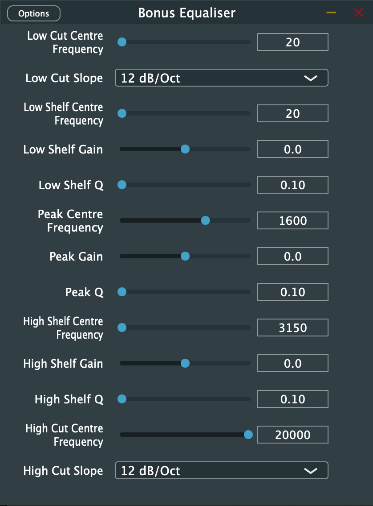
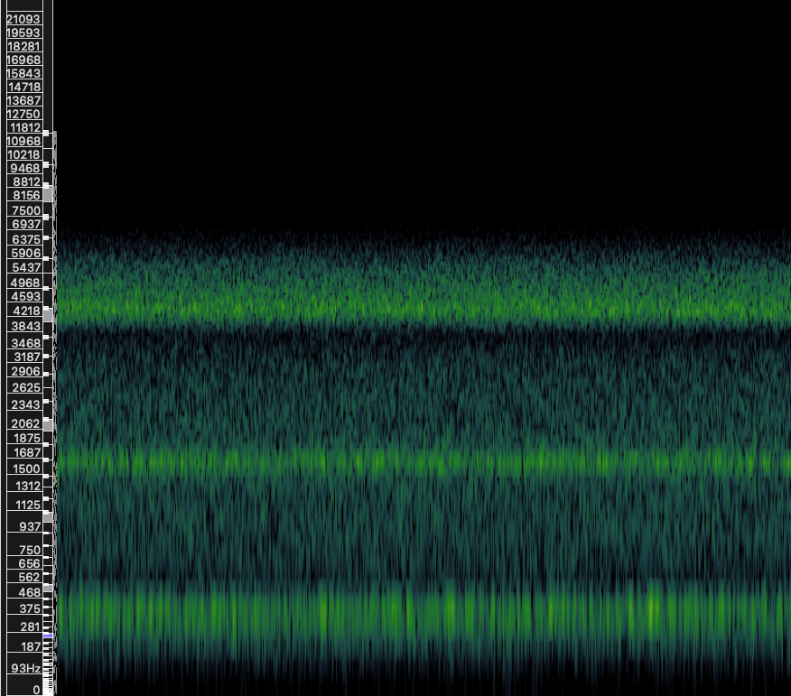

# Parametric EQ (JUCE)

A 5-band parametric equaliser plugin built with JUCE, using `juce::dsp::ProcessorChain` for stereo IIR filtering. It extends a basic 3-band graphic EQ with low cut and high cut filters with selectable slopes, and full control over the frequency, gain and Q of every band.

## Features

| Band | Controls | Range |
| --- | --- | --- |
| Low Cut | Frequency, Slope | 20 to 400 Hz; 12 / 24 / 36 / 48 dB/oct |
| Low Shelf | Frequency, Gain, Q | 20 to 400 Hz; ±24 dB; Q 0.1 to 10 |
| Peak | Frequency, Gain, Q | 400 to 3150 Hz; ±24 dB; Q 0.1 to 10 |
| High Shelf | Frequency, Gain, Q | 3150 to 20000 Hz; ±24 dB; Q 0.1 to 10 |
| High Cut | Frequency, Slope | 3150 to 20000 Hz; 12 / 24 / 36 / 48 dB/oct |

- Signal path: `CutFilter -> LowShelf -> Peak -> HighShelf -> CutFilter`, one chain per channel. Each cut filter is a chain of four IIR stages; stages are enabled according to the chosen slope.
- Parameters are managed with `AudioProcessorValueTreeState`; the UI is JUCE's `GenericAudioProcessorEditor`.

## Output

Spectrogram of the EQ output, with narrow boosts around 400 Hz, 1600 Hz and 3150 Hz, a 48 dB/oct low cut and a 12 dB/oct high cut:

## Building

1. Open `5B_EQ.jucer` in the Projucer.
2. Point the module paths to your local JUCE `modules` folder (the project was built with JUCE installed at `/Applications/JUCE`).
3. Save to regenerate `JuceLibraryCode/` and the Xcode project in `Builds/`, then build the VST3, AU or Standalone target.
